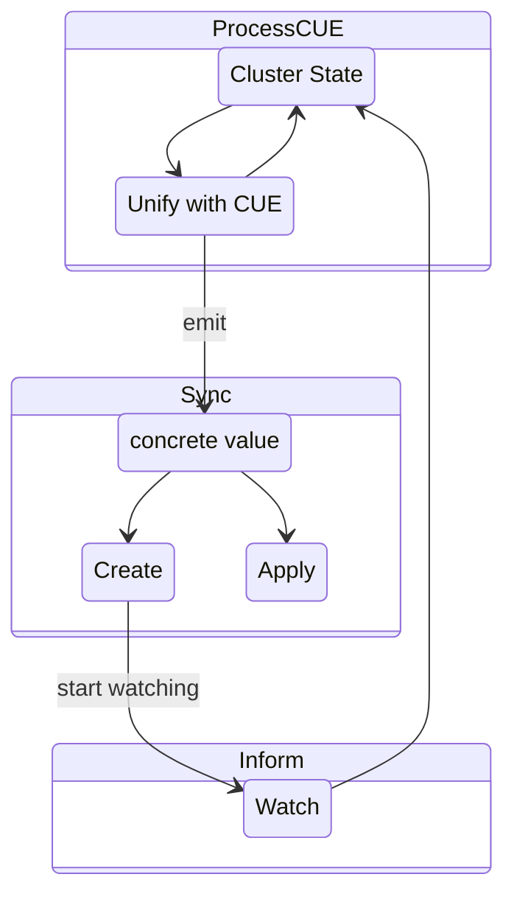

# cuebectl

`cuebectl` takes a collection of [cue files](https://cuelang.org/) that describe kubernetes resources, and continually reconciles them with 
cluster state, to allow declarative management of kubernetes resources.

## Project Status

**Exploratory** - 

this is still largely a proof of concept to work out UX and explore features. But it's in a great state
to try out, learn about CUE, and suggest ideas.

## Installation

`cuebectl` can be installed standalone or as a kubectl plugin (`kubectl-cue`). See the [latest release](https://github.com/cuebernetes/cuebectl/releases) for install instructions.

## Example

Without cuebectl, multiple imperative steps:

```sh
$ cat role.yaml
apiVersion: "rbac.authorization.k8s.io/v1"
kind: "Role"
metadata:
  namespace: mynamespace
  generateName: "test-"
rules:
 - apiGroups: ["*"]
   resources: ["*"]
   verbs: ["*"]


$ kubectl -n mynamespace create role.yaml
$ kubectl -n mynamespace get roles -o name
test-xwtdt
# reference the new role in the rolebinding
$ vim rolebinding.yaml
$ cat rolebinding.yaml
apiVersion: "rbac.authorization.k8s.io/v1"
kind: "RoleBinding"
metadata: generateName: "test-"
roleRef:
  apiGroup: "rbac.authorization.k8s.io"
  kind: "Role"
  name: "test-xwtdt"
subjects:
 - kind: "ServiceAccount"
   name: default
   namespace: mynamespace
 
$ kubectl create rolbinding.yaml
```

With cuebectl, a single declarative application:

```sh
# cat manifests/pkg.cue
package role

import (
    rbacv1 "k8s.io/api/rbac/v1"
)

ns: "mynamespace"

Role: rbacv1.#Role & {
    apiVersion: "rbac.authorization.k8s.io/v1"
    kind: "Role"
    metadata: generateName: "test-"
    metadata: namespace: ns 
    rules: [
        {
            apiGroups: ["*"]
            resources: ["*"]
            verbs: ["*"]
        }
    ]
}

RoleBinding: rbacv1.#RoleBinding & {
    apiVersion: "rbac.authorization.k8s.io/v1"
    kind: "RoleBinding"
    metadata: generateName: "test-"
    metadata: namespace: ns
    roleRef: {
        apiGroup: "rbac.authorization.k8s.io"
        kind: "Role"
        name: Role.metadata.name
    }
    subjects: [
        {
            kind: "ServiceAccount"
            name: "default"
            namespace: ns
        }
    ]
}

$ cuebectl apply manifests
RoleBinding not yet concrete: RoleBinding.roleRef.name: undefined field name (and 2 more errors)
created Role: mynamespace/test-kdt66 (rbac.authorization.k8s.io/v1, Kind=Role)
created RoleBinding: mynamespace/test-72qmg (rbac.authorization.k8s.io/v1, Kind=RoleBinding)
```

See [example](./example/pkg.cue) for a longer example:

```sh
$ cuebectl apply example
TestServiceAccount not yet concrete: TestServiceAccount.metadata.namespace: undefined field name
TestClusterRoleBinding not yet concrete: TestClusterRoleBinding.roleRef.name: undefined field name (and 2 more errors)
created NoGenNameServiceAccount: default/test (/v1, Kind=ServiceAccount)
created TestNs: /test-ns-xwtdt (/v1, Kind=Namespace)
DependentClusterRoleBinding not yet concrete: DependentClusterRoleBinding.roleRef.name: undefined field name (and 1 more errors)
TestClusterRoleBinding not yet concrete: TestClusterRoleBinding.roleRef.name: undefined field name (and 1 more errors)
created TestClusterRole: /test-kdt66 (rbac.authorization.k8s.io/v1, Kind=ClusterRole)
created TestServiceAccount: test-ns-xwtdt/test-sa-cg6lj (/v1, Kind=ServiceAccount)
Operation cannot be fulfilled on serviceaccounts "test": the object has been modified; please apply your changes to the latest version and try again
created DependentClusterRoleBinding: /test-bp2kr (rbac.authorization.k8s.io/v1, Kind=ClusterRoleBinding)
created TestClusterRoleBinding: /test-72qmg (rbac.authorization.k8s.io/v1, Kind=ClusterRoleBinding)
```

## How does it work? 

The CUE instance provided to `cuebectl apply` is continually reconciled with the current state of the cluster. As new values become concrete (hydrated from the cluster), they are created or updated as needed. The sync continues until all top-level fields in the CUE instance are created. If `--watch`/`-w` is specified, syncing continues indefinitely.


